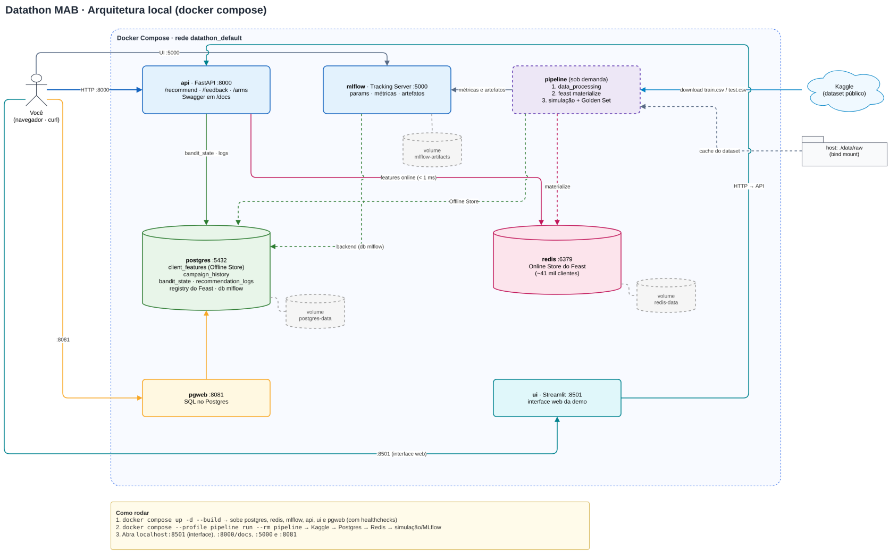
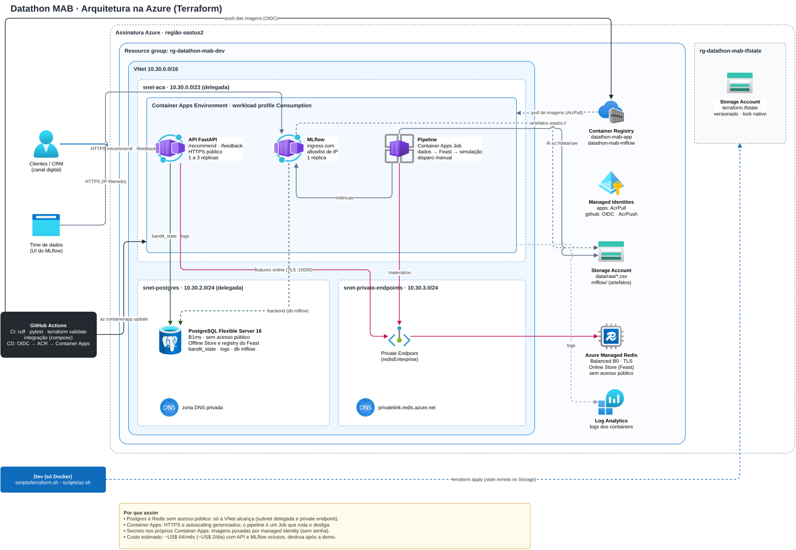
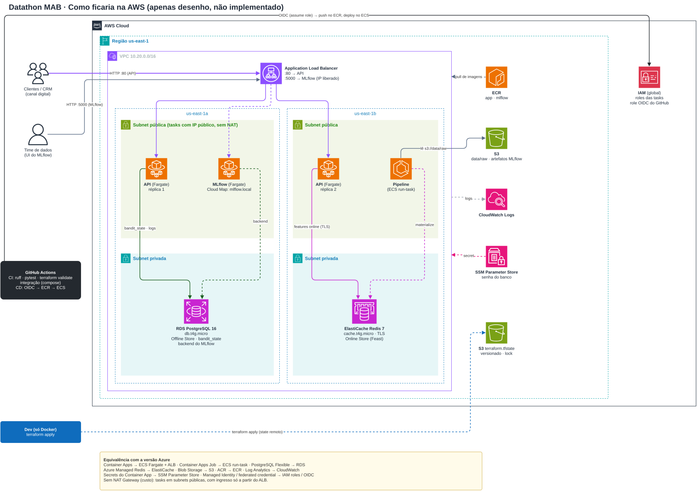

# Decisão Adaptativa de Ofertas com Multi-Armed Bandit (Thompson Sampling)

Projeto do Datathon da Pós-graduação em Machine Learning Engineering. Uma API em tempo real escolhe, para cada cliente
de uma instituição financeira digital, **por qual canal e em qual janela da semana** apresentar uma oferta. A escolha é
feita por um **Multi-Armed Bandit com Thompson Sampling** que usa o perfil do cliente e o mês da campanha como contexto e
aprende com cada conversão.

| Indicador | Resultado (média de 5 seeds, 20.052 clientes por seed) |
|---|---|
| Conversão com Thompson Sampling | **18,25%** |
| Conversão com o baseline de regra fixa | 17,46%: **+4,5% de conversões** com o bandit, que vence em 5 de 5 seeds |
| Conversão com teste A/B uniforme | 12,93%: **+41,1% de conversões** com o bandit |
| Latência para ler as features do cliente (Redis via Feast) | p50 **1,4 ms**, p95 4,6 ms (medido localmente) |
| Dataset | [Telemarketing JYB Dataset (Kaggle)](https://www.kaggle.com/datasets/aguado/telemarketing-jyb-dataset), derivado do UCI Bank Marketing |

**Sumário**

1. [Problema do negócio](#1-problema-do-negócio)
2. [Solução](#2-solução)
   - [2.1 Modelo de ML](#21-modelo-de-ml-thompson-sampling-contextual)
   - [2.2 Arquitetura local](#22-arquitetura-local)
   - [2.3 Arquitetura na nuvem](#23-arquitetura-na-nuvem-azure)
   - [2.4 Uso local](#24-uso-local)
   - [2.5 Deploy com Terraform e CI/CD](#25-deploy-com-terraform-e-cicd)
3. [Estrutura do repositório](#3-estrutura-do-repositório)

---

## 1. Problema do negócio

Em cada campanha, o banco precisa decidir **como abordar cada cliente**: ligar no celular ou no telefone fixo, no início
ou no fim da semana. A escolha errada custa conversões. Hoje essa decisão é tomada de dois jeitos, e os dois desperdiçam
dinheiro:

| Abordagem atual | Como funciona | Onde perde dinheiro |
|---|---|---|
| **Regra estática** | "Sempre ligue no celular no fim da semana", definida uma vez por um analista | Não aprende. Se um perfil ou uma época do ano responde melhor a outra abordagem, a regra continua errando. |
| **Teste A/B clássico** | Divide os clientes igualmente entre as opções por semanas e escolhe a vencedora no fim | Durante todo o teste, **a maior parte dos clientes recebe opções piores**. Cada um deles é uma conversão desperdiçada, e a decisão só chega no final. |

Os dados mostram por que a regra fixa falha: **a melhor abordagem muda ao longo do ano**. Em abril e agosto, o telefone
fixo no início da semana converte mais; em novembro, o telefone no fim da semana; em maio e setembro, o celular no
início da semana. Uma regra única erra justamente nesses meses.

**O que o negócio precisa:** uma decisão que **aprenda continuamente**, gaste o mínimo de tráfego com opções ruins,
leve em conta o perfil do cliente e o momento da campanha, e responda em tempo real.

---

## 2. Solução

Tratamos cada forma de abordagem como um **"braço" de caça-níquel** e usamos um **Multi-Armed Bandit**: um algoritmo
que **aprende enquanto decide**. Ele manda a maior parte dos clientes para a abordagem que está funcionando naquele
contexto e reserva uma fração para continuar testando as outras, mais onde há mais incerteza.

Na prática, a solução tem três partes:

1. **Dados:** o histórico de campanhas é limpo e vira uma **Feature Store** (Feast). O histórico completo fica no
   PostgreSQL, e o valor mais recente de cada cliente fica no Redis, para leitura em poucos milissegundos.
2. **Modelo:** o Thompson Sampling guarda, para cada contexto (segmento etário x mês) e cada braço, só dois números
   (sucessos e falhas) numa tabela do PostgreSQL. Os experimentos são registrados no **MLflow**.
3. **Serviço:** uma **API FastAPI** recebe o cliente (`POST /recommend`), devolve a oferta e aprende com o resultado
   (`POST /feedback`). Tudo roda em containers, localmente com Docker Compose e na nuvem com **Terraform na Azure**,
   com **CI/CD no GitHub Actions**.

**Valor gerado:**
- **+4,5% de conversões** sobre a regra fixa e **+41%** sobre o teste A/B, na simulação com as taxas reais do dataset.
- **Decisão contínua:** não existe "fim do teste". Cada feedback atualiza o modelo na hora.
- **Personalização por época e perfil:** o modelo descobre sozinho, por exemplo, que em agosto adultos respondem melhor
  ao telefone fixo e que em maio o celular no início da semana é o melhor para todos os segmentos.
- **Explicável e auditável:** o estado do modelo são contadores numa tabela SQL que qualquer analista consegue ler.

### 2.1 Modelo de ML: Thompson Sampling contextual

#### Como o modelo decide

Para cada cliente que chega, a API faz quatro passos:

1. Lê o **segmento etário** do cliente na Feature Store (Redis) e monta o **contexto** com o mês da campanha
   (ex.: `senior|may`).
2. Para cada um dos 4 braços, **sorteia** uma taxa de conversão plausível a partir de uma distribuição
   **Beta(sucessos + 1, falhas + 1)** daquele contexto. Quanto mais dados, mais o sorteio fica perto da taxa real.
3. Recomenda o braço com **o maior sorteio**.
4. Quando o resultado chega (`POST /feedback`), soma 1 em sucessos ou em falhas daquele braço, naquele contexto.

Braços bons quase sempre ganham o sorteio. Braços incertos ainda ganham de vez em quando, e é isso que mantém o modelo
aprendendo.

| Conceito | Definição no projeto |
|---|---|
| **Braços (4)** | Canal x janela da semana: `celular_inicio_semana` (seg-qua), `celular_fim_semana` (qui-sex), `telefone_inicio_semana` e `telefone_fim_semana` |
| **Contexto (36)** | Segmento etário (`jovem` <30, `adulto` 30-59, `senior` ≥60) x mês da campanha (`jan` a `dec`). Cada contexto tem seus próprios contadores |
| **Recompensa** | 1 se o cliente converteu, 0 se não |
| **Prior** | Beta(1, 1) em cada contexto e braço: nenhuma preferência antes de ver dados (equivale a 1 sucesso e 1 falha fictícios) |
| **Estado** | Tabela `bandit_state` no PostgreSQL, com atualização atômica (segura com várias réplicas da API) |

**Por que Thompson Sampling:** a exploração é proporcional à incerteza. Um braço com poucos dados tem uma Beta larga e
às vezes ganha o sorteio; um braço ruim com muitos dados quase nunca ganha. Não há hiperparâmetro de exploração para
ajustar (ao contrário do epsilon do Epsilon-Greedy), e o estado são só contadores, fáceis de auditar e de atualizar em
tempo real. O Epsilon-Greedy foi implementado como referência de comparação.

#### Dados

| Item | Descrição |
|---|---|
| **Fonte** | [Telemarketing JYB Dataset](https://www.kaggle.com/datasets/aguado/telemarketing-jyb-dataset) (`aguado/telemarketing-jyb-dataset`), versão 1, atualizada em 02/12/2022 |
| **Origem e licença** | Derivado do *Bank Marketing* da UCI (Moro, Cortez e Rita, 2014), campanhas de um banco português entre 2008 e 2010, licença CC BY 4.0. No Kaggle a licença aparece como "Other (specified in description)" |
| **Arquivos** | `train.csv`: 28.645 contatos com resultado. `test.csv`: 12.543 clientes sem resultado, usados como a base de clientes em produção |
| **Alvo** | `y`: o cliente contratou o depósito a prazo (conversão média de 11,46%) |
| **Colunas originais** | idade, profissão, estado civil, escolaridade, inadimplência, financiamento imobiliário, empréstimo, canal, mês, dia da semana, contatos na campanha, dias desde o último contato, contatos anteriores, resultado anterior e 5 indicadores macroeconômicos |

| Tratamento | Colunas | Motivo |
|---|---|---|
| **Removidas por vazamento temporal** | `duration`, `campaign` | Só são conhecidas **depois** do contato (`duration` já não vem neste arquivo) |
| **Removidas por serem sensíveis** | `marital`, `default` | LGPD e risco de discriminar clientes na oferta |
| **Removidas por não descreverem o cliente** | indicadores macroeconômicos (`emp_var_rate`, `euribor3m` etc.) | Descrevem o momento da campanha, que já entra pelo mês |
| **Transformadas em braço** | `contact`, `day_of_week` | São a **ação** executada, não uma característica do cliente |
| **Contexto** | `age` (vira o segmento) e `month` | Conhecidos no momento da decisão |
| **Servidas pela Feature Store** | `age`, `job`, `education`, `housing`, `loan`, `previous`, `days_since_last_contact` (`pdays=999` vira `-1`), `poutcome`, `customer_segment` | Atributos do cliente disponíveis em tempo real |

**Uso dos dados:** a base é pública e anônima, e os clientes do Golden Set são fictícios. **Finalidade:** escolher só
o canal e o dia do contato, nunca preço ou crédito. **Base legal**, num uso real: legítimo interesse (LGPD, art. 7º, IX),
com opt-out. **Minimização:** colunas sensíveis e desnecessárias removidas, e o modelo guarda só contadores agregados.
**Retenção:** os logs de recomendação ficam 12 meses (proposta). O modelo escolhe apenas entre ofertas aprovadas pelo
negócio (humano no loop).

**Notebooks:**
- [notebooks/01_eda.ipynb](notebooks/01_eda.ipynb): análise exploratória e tratamento dos dados.
- [notebooks/02_baseline_vs_bandit.ipynb](notebooks/02_baseline_vs_bandit.ipynb): baseline, Thompson Sampling,
  comparação, análise da exploração e Golden Set.

Os dois usam o mesmo código do pipeline (`src/`) e já estão salvos com as saídas.

#### Como avaliamos

Cada cliente do histórico recebeu só uma abordagem, então não dá para saber diretamente o que teria acontecido com as
outras. Por isso a comparação é feita por **simulação** com as taxas reais do dataset:

1. **30% dos clientes formam o histórico.** Ele define as regras dos baselines e inicializa as contagens do Thompson
   Sampling e do Epsilon-Greedy (*warm start*), para que todas as políticas comecem com a mesma informação.
2. **Os outros 70% (20.052 clientes) chegam um a um, em ordem de calendário**, como numa campanha real. Cada política
   escolhe um braço e a conversão é sorteada com a taxa observada no dataset para aquele contexto e braço. Contextos com
   poucos contatos são suavizados em direção à taxa do mês.
3. **Todas as políticas usam os mesmos números aleatórios**, então a diferença entre elas vem só das escolhas.
4. **5 seeds (42 a 46)**: os resultados são a média, com o desvio padrão e em quantos seeds o bandit venceu. Tudo é
   registrado no MLflow.

| Política | O que faz |
|---|---|
| **Thompson Sampling** | o modelo proposto |
| **Epsilon-Greedy** | referência adaptativa: 10% das vezes um braço aleatório, 90% o de maior média |
| **Baseline fixo** | **baseline do desafio**: sempre o braço de maior conversão histórica (`celular_fim_semana`) |
| **Baseline segmentado** | regra congelada por contexto: o melhor braço histórico de cada segmento e mês |
| **Teste A/B uniforme** | divide os clientes igualmente entre os 4 braços |

#### Resultados

| Política | Conversão (média ± desvio) | Conversões por seed | Regret | Lift do TS | TS vence em |
|---|---|---|---|---|---|
| Baseline segmentado | 18,32% ± 0,60 | 3.673 | 165,7 | -0,4% | 1/5 seeds |
| **Thompson Sampling** | **18,25% ± 0,33** | **3.659** | 180,2 | — | — |
| Epsilon-Greedy (ε = 0,1) | 17,97% ± 0,33 | 3.604 | 232,7 | +1,5% | 4/5 seeds |
| **Baseline fixo** | 17,46% ± 0,39 | 3.502 | 339,2 | **+4,5%** | **5/5 seeds** |
| Teste A/B uniforme | 12,93% ± 0,23 | 2.593 | 1.239,9 | +41,1% | 5/5 seeds |

*Regret* é quanto a política perdeu, em conversões esperadas, em relação a escolher sempre o melhor braço de cada
contexto. Quanto menor, melhor.

**Leitura dos resultados:**
- **O Thompson Sampling supera o baseline do desafio (regra fixa) em todos os seeds**: +0,79 ponto percentual, ou
  cerca de 790 conversões a mais a cada 100 mil clientes. Supera também o Epsilon-Greedy e o teste A/B.
- **Ele empata com o baseline segmentado**, uma regra que já conhece o melhor braço de cada segmento e mês. Essa regra
  só existe depois que alguém testou todos os braços em todos os contextos, ou seja, depende de um teste longo já
  concluído, e fica congelada depois. O bandit chega ao mesmo nível aprendendo em produção e continua se ajustando.
- **A maior parte do ganho vem do contexto** (mês e segmento). Numa versão anterior, que usava só a idade, o bandit
  empatava com a regra fixa: a melhor abordagem quase não muda entre faixas etárias, mas muda bastante entre meses.
- **Sem histórico** (`--cold-start`), o TS parte do zero e ainda supera a regra fixa (17,69% contra 17,46%). Nesse
  cenário o Epsilon-Greedy fica um pouco à frente (17,84%), porque com 36 contextos sem dado nenhum o TS explora mais
  no começo.

**Análise da exploração** (detalhes no notebook 02): a regra fixa não tem custo nos meses em que acerta (junho e julho)
e perde muito em abril, agosto e novembro, quando o melhor braço é o telefone fixo. O Epsilon-Greedy tem um custo que
nunca some, porque 10% das escolhas são sempre aleatórias. O Thompson Sampling tem custo baixo nos meses com muitos
dados e explora mais nos meses com poucos contatos (março, setembro, outubro e dezembro), onde ainda há incerteza.

#### Golden Set: 5 clientes fictícios de teste

Os clientes 900001 a 900005 entram na Feature Store junto com os reais e podem ser testados pela API. Cada caso usa um
mês de campanha. A **oferta recomendada** é o sorteio do Thompson Sampling (varia de chamada para chamada); o **melhor
braço do modelo** é o de maior conversão esperada; o **melhor braço nos dados** é o de maior taxa real naquele
contexto. A decisão faz sentido quando os dois últimos coincidem.

| client_id | Perfil | Contexto | Oferta recomendada (sorteio) | Melhor braço do modelo | Conversão esperada | Melhor braço nos dados | Faz sentido? |
|---|---|---|---|---|---|---|---|
| 900001 | 24 anos, student, sem contato anterior | `jovem\|may` | `celular_inicio_semana` | `celular_inicio_semana` | 14,96% | `celular_inicio_semana` | Sim |
| 900002 | 41 anos, admin., sem contato anterior | `adulto\|aug` | `celular_fim_semana` | `telefone_inicio_semana` | 13,54% | `telefone_inicio_semana` | Sim |
| 900003 | 67 anos, retired, converteu antes | `senior\|may` | `celular_inicio_semana` | `celular_inicio_semana` | 34,62% | `celular_inicio_semana` | Sim |
| 900004 | 35 anos, blue-collar, sem contato anterior | `adulto\|nov` | `telefone_inicio_semana` | `telefone_fim_semana` | 12,91% | `telefone_fim_semana` | Sim |
| 900005 | 29 anos, technician, não converteu antes | `jovem\|sep` | `celular_inicio_semana` | `celular_inicio_semana` | 47,83% | `celular_fim_semana` | Não |

- Em **900002** e **900004**, o modelo prefere o **telefone fixo**, ao contrário da regra fixa, porque em agosto e
  novembro é o que converte mais para adultos. O sorteio desta execução caiu em outro braço: é a exploração, que
  acontece numa fração pequena das chamadas.
- Em **900005**, o modelo ainda erra: setembro tem poucos contatos de jovens e os dois braços de celular estão próximos.
  É exatamente por isso que o Thompson Sampling continua testando os dois nesse contexto; com mais feedback, a escolha
  converge.

### 2.2 Arquitetura local



*Fonte editável: [docs/architecture/local.drawio](docs/architecture/local.drawio). Abre em [app.diagrams.net](https://app.diagrams.net) ou na extensão Draw.io Integration do VS Code.*

| Serviço | Porta | Papel |
|---|---|---|
| `api` | 8000 | API FastAPI: `/recommend`, `/feedback`, `/arms`, `/health` e o Swagger em `/docs` |
| `ui` | 8501 | Interface web (Streamlit) para usar a API sem escrever requisições: recomendar, dar o feedback e ver o que o modelo aprendeu |
| `postgres` | 5432 | **Offline Store** do Feast (`client_features`), histórico (`campaign_history`), estado do bandit (`bandit_state`), logs (`recommendation_logs`), registry do Feast e o banco do MLflow |
| `redis` | 6379 | **Online Store** do Feast: o último valor das features de cada cliente, lido pela API em menos de 1 ms |
| `mlflow` | 5000 | Tracking Server: parâmetros, métricas, gráfico de conversão e Golden Set de cada experimento |
| `pipeline` | — | Job sob demanda: (1) baixa e limpa os dados, (2) materializa as features no Redis, (3) roda a simulação e publica o estado do bandit |
| `pgweb` | 8081 | Interface gráfica do PostgreSQL |

**Os dois fluxos:**
- **Offline (batch, via `pipeline`):** Kaggle → limpeza → PostgreSQL (Offline Store) → `feast materialize` → Redis (Online
  Store) → simulação → MLflow e `bandit_state`.
- **Online (tempo real, via `api`):** o cliente chega → a API lê as features no Redis e monta o contexto (segmento x mês)
  → o Thompson Sampling sorteia com os contadores do PostgreSQL → a recomendação é registrada → o feedback atualiza
  os contadores daquele contexto.

### 2.3 Arquitetura na nuvem (Azure)

Para colocar o projeto no ar, usamos a **Azure**, com toda a infraestrutura criada por Terraform. A API e o MLflow rodam
no **Azure Container Apps**, um serviço de containers gerenciado que dá HTTPS, escala automática e cobra por uso, sem
precisar administrar servidores. O pipeline de dados roda como um **Container Apps Job**, que sobe, executa e desliga.
Os dados ficam em serviços gerenciados: **PostgreSQL Flexible Server** (Offline Store, estado do bandit e banco do
MLflow), **Azure Managed Redis** (Online Store) e **Blob Storage** (dataset e artefatos do MLflow). As imagens ficam no
**Container Registry** e os logs no **Log Analytics**.

O banco e o cache não têm acesso público: ficam numa rede privada (VNet) e só os containers do projeto os alcançam. O
GitHub Actions publica novas versões usando uma identidade federada (OIDC), sem senhas guardadas no repositório. Na
**AWS**, a mesma arquitetura usaria ECS Fargate com Application Load Balancer no lugar do Container Apps, RDS for
PostgreSQL, ElastiCache for Redis, S3, ECR e CloudWatch (desenho no fim desta seção).



*Fonte editável: [docs/architecture/azure.drawio](docs/architecture/azure.drawio).*

A mesma aplicação roda na Azure, criada inteiramente por Terraform ([terraform/](terraform/)). Só mudam as variáveis de
ambiente: as imagens são as mesmas do ambiente local.

| Recurso Azure | Equivalente local | Papel |
|---|---|---|
| **Container Apps** (API e MLflow) | `api`, `mlflow` | HTTPS gerenciado; a API escala de 1 a 3 réplicas por volume de requisições; o MLflow só aceita os IPs liberados |
| **Container Apps Job** | `pipeline` | Roda o pipeline sob demanda e desliga |
| **PostgreSQL Flexible Server 16** | `postgres` | Mesmo papel. **Sem acesso público**: só a VNet alcança |
| **Azure Managed Redis** | `redis` | Mesmo papel, com TLS. **Sem acesso público** (private endpoint). É o sucessor do Azure Cache for Redis, que será aposentado em 2028 |
| **Storage Account (Blob)** | pasta `data/` e volume do MLflow | Dataset bruto (`data/raw/`) e artefatos do MLflow |
| **Container Registry** | imagens locais | Guarda as imagens publicadas pelo CI/CD |
| **VNet, managed identities, Log Analytics** | rede do compose | Rede privada, acesso sem senha às imagens e logs dos containers |

#### Custo estimado

Preços da [Azure Retail Prices API](https://prices.azure.com/api/retail/prices) (região `eastus2`, preço de lista, 730 h/mês; o deploy padrão usa `centralus`, porque assinaturas novas não podem criar PostgreSQL na `eastus2`, e o preço pode variar um pouco),
consultados em 2026-09-27:

| Item | Preço unitário | Por mês |
|---|---|---|
| PostgreSQL Flexible B1ms + 32 GB | US$ 0,017/h + US$ 0,115/GB | US$ 16,09 |
| API no Container Apps (1 réplica sempre ligada, 0,5 vCPU / 1 GiB, ociosa) | US$ 0,000003/vCPU-s e /GiB-s | ~US$ 11,83 |
| MLflow no Container Apps (mesmo tamanho, ocioso) | idem | ~US$ 11,83 |
| Azure Managed Redis Balanced B0 (sem HA) | US$ 0,016/h | US$ 11,68 |
| Private endpoint do Redis | US$ 0,01/h | US$ 7,30 |
| Container Registry Basic | US$ 0,1666/dia | US$ 5,07 |
| Log Analytics (5 GB/mês grátis) e execuções do pipeline | — | ~US$ 0 |
| **Total** | | **~US$ 64/mês (~US$ 2/dia)** |

O total considera API e MLflow **ociosos** na maior parte do tempo. Réplicas processando requisições 24 horas por dia
pagam a tarifa ativa (US$ 0,000024/vCPU-s), e cada app chegaria a ~US$ 39/mês. A franquia gratuita mensal do Container
Apps (180 mil vCPU-s e 360 mil GiB-s por assinatura) desconta alguns dólares. Para uma demo, suba perto da apresentação
e rode `destroy` depois: alguns dias custam poucos dólares.

Se o ambiente precisar ficar no ar por semanas, dá para cortar o custo para **~US$ 27/mês** (não aplicado no código):

| Otimização | Economia | Contrapartida |
|---|---|---|
| Redis como Container App (`redis:7`, 0,25 vCPU / 0,5 GiB) no lugar do Managed Redis e do private endpoint | ~US$ 13/mês | Sem SLA; os dados somem num restart (basta materializar de novo) |
| MLflow com `min_replicas = 0` | ~US$ 12/mês | A UI leva ~20-40 s para acordar |
| API com `min_replicas = 0` fora do dia da demo | ~US$ 12/mês | A primeira requisição leva ~10-30 s (cold start) |
| Parar o Postgres quando não estiver em uso (`az postgres flexible-server stop`) | até ~US$ 12/mês | Só o disco é cobrado; a Azure religa após 7 dias |
| Conta Free ou Students com a oferta de 12 meses (750 h/mês de B1ms + 32 GB) | até US$ 16/mês | Depende da conta |

#### Como ficaria na AWS (apenas desenho, não implementado)



A arquitetura foi desenhada primeiro para a AWS. Por disponibilidade de conta, o deploy foi feito na Azure, que tem um
serviço equivalente para cada peça.

*Fonte editável: [docs/architecture/aws.drawio](docs/architecture/aws.drawio).* Equivalências: Container Apps → ECS
Fargate + Application Load Balancer, Container Apps Job → ECS run-task, PostgreSQL Flexible → RDS, Managed Redis →
ElastiCache, Blob Storage → S3, ACR → ECR, Log Analytics → CloudWatch, secrets do Container App → SSM Parameter Store e
managed identities → IAM roles com OIDC.

### 2.4 Uso local

**Pré-requisitos:**
- Docker com Compose v2 e cerca de 4 GB livres em disco.
- **Pelo menos 2 GB de RAM para o Docker.** A stack com o pipeline rodando chega a ~1,3 GB; no Docker Desktop,
  recomenda-se 3 GB ou mais em Settings > Resources.
- As portas 5432, 6379, 5000, 8000, 8081 e 8501 livres.
- Nada de dataset para baixar: o pipeline busca no Kaggle automaticamente. Se preferir, coloque `train.csv` e `test.csv` em `data/raw/`.

**Passo 1: subir a stack**

```bash
docker compose up -d --build
docker compose ps          # aguarde os 6 serviços ficarem "healthy"
```

**Passo 2: rodar o pipeline** (dados → Feature Store → simulação com 5 seeds → MLflow), cerca de 1 a 2 minutos

```bash
docker compose --profile pipeline run --rm pipeline
```

Resultado esperado no fim do log: a tabela com a conversão média de cada política (Thompson Sampling 18,25%, baseline
fixo 17,46%, teste A/B 12,93%), o lift do bandit sobre cada uma e a tabela do Golden Set.

**Passo 3: usar**

| O que | Endereço |
|---|---|
| **Interface web** (o jeito mais fácil de usar) | <http://localhost:8501> |
| API (Swagger, para testar os endpoints) | <http://localhost:8000/docs> |
| MLflow (experimentos, métricas, gráfico de conversão) | <http://localhost:5000> |
| pgweb (tabelas do PostgreSQL, aceita SQL livre) | <http://localhost:8081> |

Na **interface web**, escolha um cliente do Golden Set (ou digite um id da base) e o mês da campanha e clique em
*Recomendar*. A tela mostra a oferta escolhida, o sorteio de cada forma de contato e os dados do cliente vindos do
Redis. Os botões *Sim, converteu* e *Não converteu* enviam o feedback e mostram o contador atualizado. A aba *O que o
modelo aprendeu* mostra a conversão esperada de cada oferta por segmento, mês a mês.

Pela linha de comando:

```bash
# Recomendação para um cliente (features vindas do Redis). campaign_month é opcional: sem ele, vale o mês atual.
curl -s -X POST localhost:8000/recommend -H 'content-type: application/json' \
  -d '{"client_id": 900002, "campaign_month": "aug"}'
# {"recommendation_id":28,"client_id":900002,"segment":"adulto","campaign_month":"aug","context":"adulto|aug",
#  "recommended_offer":"telefone_inicio_semana","offer_description":"Oferta via telefone fixo, de segunda a quarta",
#  "sampled_scores":{"celular_inicio_semana":0.0982,"celular_fim_semana":0.1093,"telefone_inicio_semana":0.1346,
#  "telefone_fim_semana":0.0588},"features":{"age":41,"job":"admin.",...},"feature_latency_ms":1.35}

# Feedback: o cliente converteu (1) ou não (0); o contador do braço, naquele contexto, é atualizado na hora
curl -s -X POST localhost:8000/feedback -H 'content-type: application/json' -d '{"recommendation_id": 28, "reward": 1}'
# {"recommendation_id":28,"context":"adulto|aug","offer":"telefone_inicio_semana","reward":1,"successes":...,"failures":...}

# Estado do modelo: contadores e conversão esperada por contexto e braço (?month= filtra um mês)
curl -s "localhost:8000/arms?month=aug"
```

| Situação | Resposta |
|---|---|
| Cliente que não está na Feature Store | `404` |
| Feature Store ainda não materializada (pipeline não rodou) | `503`, com a instrução para rodar o pipeline |
| Feedback repetido para a mesma recomendação | `409` |
| `reward` diferente de 0 ou 1, ou `campaign_month` inválido | `422` |

> O Feast grava as features no Redis em formato binário (protobuf), que nenhuma interface de Redis consegue
> mostrar de forma legível. Para ver as features de um cliente, use a interface web ou o `POST /recommend`.

**Notebooks** (só com Docker; o Jupyter Lab abre em <http://localhost:8888>):

```bash
docker run --rm -it --user "$(id -u):$(id -g)" -e HOME=/tmp -p 8888:8888 -v "$PWD:/w" -w /w datathon-mab-app:latest \
  sh -c "pip install -q --user jupyterlab && python -m jupyterlab --ip 0.0.0.0 --no-browser --IdentityProvider.token=''"
```

Sem Docker: `python -m venv .venv && . .venv/bin/activate && pip install -r requirements-dev.txt && jupyter lab`.
Os notebooks leem `data/raw/train.csv` (ou baixam do Kaggle) e não dependem da stack estar no ar.

**Comandos úteis:**

```bash
docker compose run --rm api python -m pytest -q                                   # testes unitários
python3 scripts/smoke_test.py --url http://localhost:8000                         # teste de ponta a ponta da API
docker compose run --rm api python feature_store/materialize.py                   # só rematerializar o Feast
docker compose run --rm api python -m src.train_and_experiment --cold-start --no-publish   # simulação sem histórico
docker compose down                                                               # parar (mantém os dados)
```

Rodar o pipeline de novo reproduz os mesmos números (seeds fixas) e reinicia os contadores do bandit.

> **Podman:** também funciona com `podman-compose` (as imagens usam nomes totalmente qualificados). Não rode Podman e
> Docker ao mesmo tempo, porque os dois disputam as mesmas portas.

### 2.5 Deploy com Terraform e CI/CD

#### Ferramentas: só Docker

Não é preciso instalar Terraform nem Azure CLI. Os scripts [scripts/terraform.sh](scripts/terraform.sh) e
[scripts/az.sh](scripts/az.sh) rodam os dois dentro de um container ([docker/tools/Dockerfile](docker/tools/Dockerfile)),
que é construído automaticamente na primeira vez. O login fica salvo em `~/.azure`.

```bash
cd ~/Documents/study/datathon
alias terraform="$PWD/scripts/terraform.sh"
alias az="$PWD/scripts/az.sh"

az login --use-device-code     # abre um código para confirmar em https://microsoft.com/devicelogin
az account show                # confere a assinatura ativa
```

**Requisitos da conta:** papel **Owner** na assinatura (ou Contributor + User Access Administrator), porque o
Terraform cria atribuições de papel.

**Se o login for bloqueado** (erro `AADSTS530035: Access has been blocked by security defaults`), use um **service
principal**. As *security defaults* do Entra ID bloqueiam o login por código de dispositivo, mas não se aplicam a
service principals. Faça uma vez só, pelo portal:

1. **Microsoft Entra ID > App registrations > New registration**: nome `datathon-deploy` e *Register*. Anote o
   *Application (client) ID* e o *Directory (tenant) ID*.
2. No app, **Certificates & secrets > Client secrets > New client secret**. Copie o *Value*: ele aparece uma vez só.
3. **Subscriptions >** sua assinatura **> Access control (IAM) > Add > Add role assignment**:
   - aba *Privileged administrator roles* > **Owner** > *Next*;
   - *Members* > *Select members* > `datathon-deploy`;
   - em *Conditions*, a opção recomendada ("Allow user to assign all roles except privileged administrator roles
     Owner, UAA, RBAC Administrator");
   - *Review + assign*.
4. Preencha as credenciais:
   ```bash
   cp .env.azure.example .env.azure   # ARM_TENANT_ID, ARM_CLIENT_ID, ARM_CLIENT_SECRET e ARM_SUBSCRIPTION_ID
   ```

O `.env.azure` fica fora do Git e é carregado pelos scripts: o Terraform autentica direto com ele, e o `deploy.sh` faz
o login do Azure CLI sozinho. O segredo chega ao container só como variável de ambiente.

#### Passo a passo do deploy

**Atalho:** [scripts/deploy.sh](scripts/deploy.sh) executa os 7 passos abaixo em ordem. Antes, ele registra os
provedores de recursos na assinatura (uma assinatura nova vem sem nenhum, e a Azure responde "SubscriptionNotFound").
Ele também gera o `terraform.tfvars` com a sua assinatura e o seu IP público, roda o `terraform init` quando
necessário e pula o que já existe (o `backend.hcl` e o `tfvars`).

```bash
./scripts/deploy.sh                    # tudo, do state ao smoke test (pede confirmação nos applies)
./scripts/deploy.sh images apply       # só alguns passos: providers bootstrap tfvars init acr images apply data pipeline test
AUTO_APPROVE=1 ./scripts/deploy.sh     # sem confirmações do Terraform
./scripts/deploy.sh destroy            # apaga o ambiente (o state é mantido)

# Nova versão do código num ambiente que já existe (o Terraform não troca a imagem; o update troca)
IMAGE_TAG=v2 ./scripts/deploy.sh images update pipeline test
```

Os comandos equivalentes, passo a passo:

```bash
# 0. Uma vez só, em assinatura nova: registrar os provedores (repita para Network, ManagedIdentity, ContainerRegistry,
#    App, OperationalInsights, DBforPostgreSQL e Cache; `az provider show -n <ns>` mostra o estado)
az provider register --namespace Microsoft.Storage --wait

# 1. Uma vez só: Storage Account que guarda o state do Terraform (gera terraform/backend.hcl)
./scripts/bootstrap_tfstate.sh centralus

# 2. Variáveis: subscription_id (az account show --query id -o tsv) e seu IP em mlflow_allowed_cidrs
cp terraform/terraform.tfvars.example terraform/terraform.tfvars
terraform -chdir=terraform init -backend-config=backend.hcl

# 3. Primeiro só o registry, e depois as imagens (os Container Apps precisam delas para subir)
terraform -chdir=terraform apply -target=azurerm_container_registry.main
./scripts/push_images.sh latest

# 4. Todo o resto (~15-25 min)
terraform -chdir=terraform apply

# 5. Dataset no Blob Storage (o pipeline na nuvem lê de az://data/raw/)
SA=$(terraform -chdir=terraform output -raw storage_account_name)
az storage blob upload --account-name "$SA" --container-name data --name raw/train.csv --file data/raw/train.csv --auth-mode key
az storage blob upload --account-name "$SA" --container-name data --name raw/test.csv  --file data/raw/test.csv  --auth-mode key

# 6. Pipeline na nuvem e acompanhamento dos logs
eval "$(terraform -chdir=terraform output -raw run_pipeline_command)"
az containerapp job logs show -n datathon-mab-dev-pipeline -g rg-datathon-mab-dev --container pipeline --follow --format text

# 7. Teste
API=$(terraform -chdir=terraform output -raw api_url)
python3 scripts/smoke_test.py --url "$API" --wait 120 --no-feedback
terraform -chdir=terraform output -raw mlflow_url
```

- **Para destruir o ambiente:** `terraform -chdir=terraform destroy`.
- **Onde fica o state:** num Storage Account (`sttfdatathon<id>`) com resource group próprio, fora do Terraform do
  projeto, para não ser apagado por um `destroy`. Ele é versionado e tem lock.
- **Logs da API:** `az containerapp logs show -n datathon-mab-dev-api -g rg-datathon-mab-dev --follow --format text`.

#### CI/CD (GitHub Actions)

```
 push / PR ──► CI
               ├─ Lint (ruff check + ruff format --check)
               ├─ Testes unitários (pytest)
               ├─ Terraform (fmt -check + init -backend=false + validate)
               └─ Integração: docker compose up --wait → pipeline completo → smoke test na API
                                              │
 CI verde na main ──► CD (environment "production", aprovação opcional)
               ├─ Login na Azure via OIDC (sem segredos guardados no GitHub)
               ├─ Build + push das imagens para o ACR, com a tag do commit
               ├─ az containerapp update: MLflow e API (a nova versão só entra no ar se ficar saudável)
               ├─ [opcional] roda o pipeline no Container Apps Job
               └─ Smoke test na URL pública (sem feedback, para não alterar os contadores reais)
```

| Workflow | Arquivo | Quando roda |
|---|---|---|
| CI | [.github/workflows/ci.yml](.github/workflows/ci.yml) | Push na `main`, pull requests e manualmente |
| CD | [.github/workflows/cd.yml](.github/workflows/cd.yml) | Depois de um CI verde na `main`, ou manualmente (com a opção `run_pipeline`) |

**Configuração (uma vez só):**

1. No `terraform.tfvars`, preencha `github_repository = "<owner>/<repo>"` e rode `terraform apply`. Isso cria a
   identidade que o GitHub usa, com permissão só para publicar imagens e atualizar o resource group do projeto.
   Repositórios novos no GitHub enviam o *subject* do token com IDs numéricos
   (`repo:<owner>@<id>/<repo>@<id>:environment:production`). Se o login do CD falhar com `AADSTS700213`, copie o
   *subject claim* mostrado no log do passo "Login na Azure", coloque em `github_oidc_subject` no `terraform.tfvars`
   e rode `terraform apply` de novo.
2. No GitHub, em **Settings > Environments**, crie o environment `production` com as variáveis:

   | Variável | Valor |
   |---|---|
   | `AZURE_CLIENT_ID` | `terraform output -raw github_azure_client_id` |
   | `AZURE_TENANT_ID` | `terraform output -raw github_azure_tenant_id` |
   | `AZURE_SUBSCRIPTION_ID` | `terraform output -raw github_azure_subscription_id` |
   | `PROJECT_PREFIX` | só se mudou o padrão `datathon-mab-dev` |

3. Em **Settings > Secrets and variables > Actions > Variables**, crie a variável de repositório `CD_ENABLED = true`.
   Sem ela, o CD é pulado e só o CI roda.
4. No primeiro deploy pelo GitHub, rode o CD manualmente com `run_pipeline = true` (Actions > CD > Run workflow), a
   menos que já tenha rodado o pipeline no passo 6 acima.

---

## 3. Estrutura do repositório

```
├── notebooks/
│   ├── 01_eda.ipynb             # análise exploratória e tratamento dos dados
│   └── 02_baseline_vs_bandit.ipynb  # baseline x Thompson Sampling, exploração e Golden Set
├── src/
│   ├── config.py                # variáveis de ambiente, braços, segmentos, meses e contextos
│   ├── data_processing.py       # Kaggle/Blob → limpeza → Offline Store (Postgres)
│   ├── database.py              # SQLAlchemy: bandit_state, recommendation_logs
│   ├── bandit.py                # Thompson Sampling, Epsilon-Greedy, baselines e teste A/B
│   ├── simulation.py            # simulação das políticas (usada pelo pipeline e pelo notebook)
│   ├── train_and_experiment.py  # simulação com vários seeds + MLflow + Golden Set
│   ├── golden_set.py            # 5 clientes fictícios de teste
│   └── api.py                   # FastAPI: /recommend, /feedback, /arms, /health
├── ui/                         # interface web (Streamlit) que consome a API
├── feature_store/
│   ├── feature_store.yaml       # Offline = Postgres, Online = Redis, registry SQL
│   ├── features.py              # Entity client_id + FeatureView client_features
│   └── materialize.py           # feast apply + materialize (Postgres → Redis)
├── docs/architecture/           # diagramas draw.io (local, Azure e AWS proposta) + PNG
├── docker/mlflow/               # imagem do MLflow Tracking Server
├── docker/tools/                # imagem com Terraform + Azure CLI (deploy só com Docker)
├── scripts/
│   ├── run_pipeline.sh          # dados → Feast → simulação
│   ├── smoke_test.py            # teste de ponta a ponta da API (CI e CD)
│   ├── terraform.sh, az.sh      # Terraform e Azure CLI via Docker
│   ├── deploy.sh                # deploy completo na Azure (todos os passos da seção 2.5)
│   ├── bootstrap_tfstate.sh     # Storage Account do state do Terraform
│   └── push_images.sh           # build + push das imagens para o ACR
├── terraform/                   # Container Apps, Postgres, Managed Redis, Storage, ACR, VNet, OIDC do GitHub
├── tests/                       # testes unitários (políticas, simulação e conexão com o Redis)
├── .github/workflows/           # ci.yml e cd.yml
├── Dockerfile · docker-compose.yml · pyproject.toml
└── requirements.txt · requirements-dev.txt   # dependências da aplicação · lint e notebooks
```
